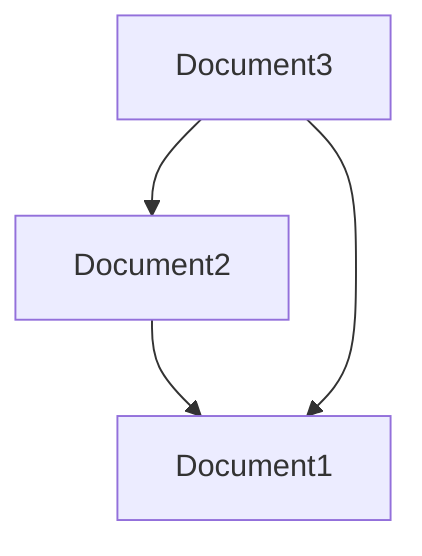
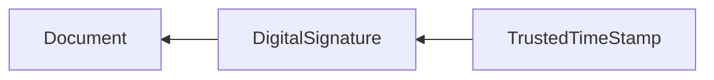
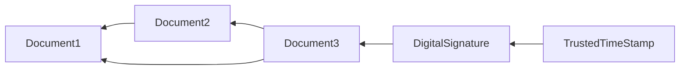
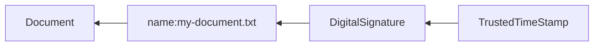

# What the heck is content-addressable internet?

In the previous [article], I highlighted some problems with the current location-based Internet. The main idea of the content-addressable Internet (CAI) is to use a result of different cryptographic functions of data as an address instead of a network location (like an IP address).

One of the main properties of content-addressable Internet is protocol agnosticism. Protocol agnosticism means that it doesn't matter how we receive data; as soon as we can validate and prove some vital hypothesis about the nature of the data offline. For example, we can do these operations offline: check a hash value, validate a digital signature, and decrypt messages using asymmetric cryptography.

In the next sections, I described the architecture of CAI. It contains multiple layers. To implement a particular layer, we should implement all lower layers.

## Layer 0. A DAG of immutable data

This is the foundation of CAI. The layer works with immutable data blocks. If we would like to reference a data block from our document, we can use [NI RFC]. For example, `ni:///sha256;980...`. Such addressing allows global addressing without name conflicts.

CAI doesn't specify which hash function we should use, and good CAI software should support multiple hash functions. The main requirement of the CAI hash functions is that they should be cryptographically secure. I wouldn't recommend to use SHA1, for example. However, some hash functions are better for CAI because they can reduce traffic and storage by detecting duplicate parts. [Blockset] implements a hash function called CDT0, which allows traffic reduction but can be extended to support other hash functions. You can read more about the content-dependent tree hash (CDT) in the [article].

Any document can reference other existing immutable documents using their hashes. Such links form a directed acyclic graph (DAG). If our hash function is cryptographically secure, then it is almost impossible to form cycles in the graph.



## Layer 1. Decentralized identity

The previous section describes a cryptographic hash function that converts content to hash value. This works well for immutable data. This section describes a function that creates a [decentralized identity] using [public key cryptography](https://en.wikipedia.org/wiki/Public-key_cryptography). Such decentralized identity (DID) using private and public keys allows the creation of a digital signature for any document. 

However, creating a digital signature is not enough to claim intellectual property (IP) rights because someone else can also create their own digital signature. The solution is to apply a [trusted timestamp]. Creating a trusted time stamp requires trusted centralized services or the consensus of many users, like in blockchain. Now, even if someone else signs your document, they will have difficulty creating a trusted time stamp that precedes yours.



Note that we should always apply a trusted time stamp to a digital signature before publishing the chain of data blocks.

Applying a trusted time stamp for each document or message could be expensive, but we can reduce the cost of a trusted timestamp by signing only a top-level document referencing other unsigned documents.



Decentralized identifiers can be referenced from documents using [DID URL](https://www.w3.org/TR/did-core/#did-url-syntax).

## Layer 2. Everyone is the center of the universe

```json
{
  "names": {
    "my-document.txt": "ni:///sha256;980...",
    "my-friend": "did:method:246...",
    "Microsoft": "https://microsoft.com"
  }
}
```

If someone with a public key (`method:345...`) named a document (`my-document.txt`), then we can use the name to reference the document. For example, `did:method:345.../my-document.txt`. This is a reference on a mutable document because the user may create a new version of the document with the same name at any time.



Public key cryptography also allows secure communication with two or more parties without sending private keys or passwords to each other. 

Using hash values and public keys as URLs is not convenient; it is similar to using IP addresses instead of DNS names.

Currently, to name things we either use centralized services (like DNS) or consensus based services, like blockchains (decentralized domain name services). In both cases, it requires payments, prone to cybersquatting and not scalable solutions.

But, why  can't I have my own catalog of names?

I can create a catalog of names and corresponding public keys. This catalog can include names for different DId including my. Then, I can reference identities and documents using my catalog as a root. 

## State

You may notice that some software already works this way, for example P2P networks, block chains, etc. So what is the fundamental difference between decentralized services and CAI. There is no difference except that CAI put all of these existing and future services together and doesn't dictate requirements such as cryptocurrency fee to include your data to their network (e.g. block chain). You may use multiple different centralized or decentralized service and pay for them, for example to promote your content, but it is not required. And, at any time you can leave these services and keep your data. No vendor lock in when you create, share and store your data.

How is it different to GIT and other version control systems?


Diagram which shows current Web2, decentralized networks with different storages, CAI: combined storage with multiple protocols. 
