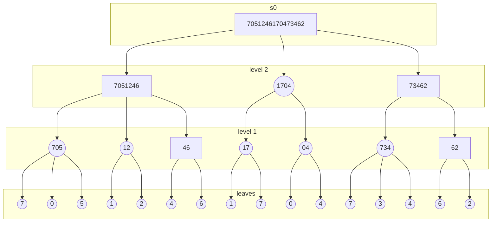
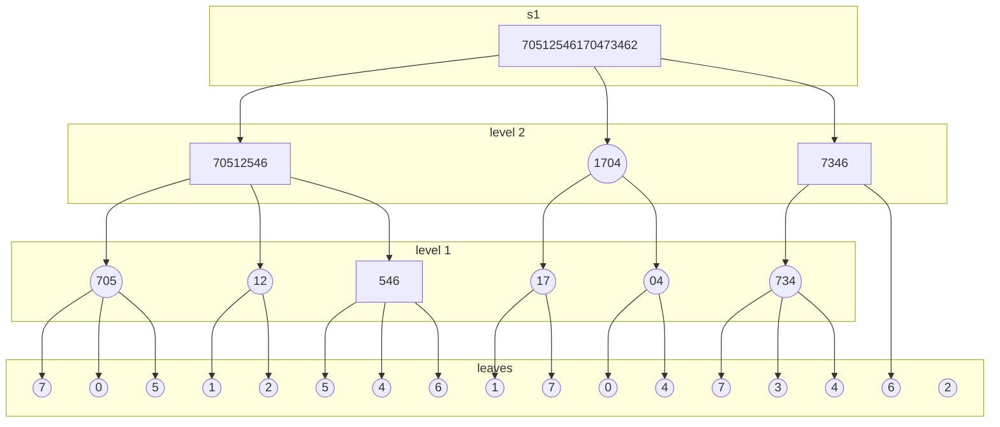

# Content-Dependent Hash Tree

In our [early discussion](some-aspects-of-merkle-tree.md), we highlighted the advantages of using a cryptographic hash function based on a [Merkle tree](https://en.wikipedia.org/wiki/Merkle_tree) for data transferring in [CAN](https://en.wikipedia.org/wiki/Content-addressable_network). However, the Merkle tree is not shift-resistant, leading to potential redundancies in our block set or [CAS](https://en.wikipedia.org/wiki/Content-addressable_storage). Here, we delve deeper to tackle this challenge.

The main reason why I publish the algorithm is because I firmly believe that we can't solve the [data vendor lock-in problem](data-vendor-lock-in.md) if we keep our data in proprietary formats. 

## Deciphering a Sequence of Numbers

Imagine intercepting messages from extraterrestrials. We don't know their language, but we assume that they use a sequential language unless they are from the [Arrival](https://en.wikipedia.org/wiki/Arrival_(film)) film. The messages manifest as a sequence of numbers. We know that each number can be a finite number between `0` and `N-1`. How can we structure the stream without linguistic reference points? How do we identify repetitive segments?

Using N=8 as an example, consider these similar sequences:
- `s0 = [7, 0, 5, 1, 2, 4, 6, 1, 7, 0, 4, 7, 3, 4, 6, 2]` and
- `s1 = [7, 0, 5, 1, 2, 5, 4, 6, 1, 7, 0, 4, 7, 3, 4, 6]`.

At a glance, shared groupings `[7, 0, 5, 1, 2]` and `[6, 1, 7, 0, 4, 7, 3, 4, 6]` are evident. But what about handling mammoth data streams in the range of gigabytes or terabytes? Some algorithms require `O(n^2)` operations, where `n` is the length of the sequences. We need something close to `O(n)`. To achieve this, we should split our sequences into groups without knowledge of other sequences.

If we group the numbers by pairs, like Merkle Tree does, we will have
- `s0`: `[[7, 0], [5, 1], [2, 4], [6, 1], [7, 0], [4, 7], [3, 4], [6, 2]]`,
- `s1`: `[[7, 0], [5, 1], [2, 5], [4, 6], [1, 7], [0, 4], [7, 3], [4, 6]]`.

As you can see, initially, we have the same groups `[7, 0]`, `[5, 1]`, but after that our groups are all different. The problem with such an approach is that the group size is fixed and independent of the group's content.

One simple idea to have content-dependant grouping is to group numbers until they stop descending:
- `s0`: `[[7, 0, 5], [1, 2], [4, 6], [1, 7], [0, 4], [7, 3, 4], [6, 2]]`,
- `s1`: `[[7, 0, 5], [1, 2], [5, 4, 6], [1, 7], [0, 4], [7, 3, 4], [6]]`.

One important rule is the autonomy of each group, akin [context-free grammar](https://en.wikipedia.org/wiki/Context-free_grammar). Grouping should only depend on items within the group. Extracting an element from a sequence mandates its inclusion in the current group. There's no going back. Sorry, "No Return Policy". An item may end the current group, and we will create a new one for the following numbers. Context-free grouping is suitable for validation because we can always validate a group without knowledge of surrounding groups.

This algorithm can create the same groups of numbers in both sequences despite a shift in the middle: `[7, 0, 5]` - 2 times, `[1, 2]` - 2 times, `[1, 7]` - 2 times, `[0, 4]` - 2 times, `[7, 3, 4]` - 2 times. The next step is to convert each group into a number and repeat the process. T

Let's try a simple approach: our function will convert numbers to strings and then concatenate them:

- `s0 = ['705', '12', '46', '17', '04', '734', '62']`,
- `s1 = ['705', '12', '546', '17', '04', '734', '6']`.

The next level of grouping will have the same group `1704`: 

- `s0 = ['7051246', '1704', '73462']`,
- `s1 = ['70512546', '1704', '7346']`,

And the roots of the trees:

- `s0 = ['7051246170473462']`
- `s1 = ['7051254617047346']`

This function works for small sequences, but to create a good function for big data blocks, we need to research the properties of the groups.

## Group Properties

A group can have a maximum of `N+1` items. For example, the longest groups for `N=8` will be `[7, 6, 5, 4, 3, 2, 1, 0, x]`, where `x` is any number from `0` to `7`.
A group can be partitioned into:
- **Body**, all items in the group except the last one.
- **Tail**, the last item in the group.

Properties of a body:
- a body has at least one item,
- numbers in the body never repeat,
- numbers are arranged in ascending order,
- the total number of unique bodies equals `2^N - 1`. The proof of this is your homework.

Properties of a tail:
- it's always one item,
- the item is less than or equal to the last number of the body.

So the total group count will be `M = N*2^(N-1) + (N-1)*2^(N-2) + ... + 3*2^2 + 2*2 + 1 = (N-1)*2^N+1`. Additional homework!

The number of internal states during group assembling is `S = (N-1)*2^(N+1)`.

|N  |   M|   S|
|---|----|----|
|2  |5   |8   |
|3  |17  |32  |
|4  |49  |96  |
|5  |129 |256 |
|6  |321 |640 |
|7  |769 |1536|
|8  |1793|3584|

The average length of the group is [e](https://en.wikipedia.org/wiki/E_(mathematical_constant)), ~2.71828 or less for small `N`. Another homework.

## Bit Stream

We can start building our tree from any `N`. The smallest possible `N` is `2`, and a leaf is either `0` or `1`. A good thing about a bit stream is that it doesn't rely on any artificial structure like a byte.

### Level 1

The level 1 has 5 groups. Each group forms a new number id for the next level.

|group|id|
|-----|--|
|00   | 0|
|01   | 1|
|11   | 2|
|100  | 3|
|101  | 4|

- `N = 5`
- `S = 8`
- Min size: 2 bits. For example: `00`.
- Max size: 3 bits. For example: `101`.

### Level 2

We use 5 numbers from the previous level as input for this level.

- `N = 4*2^5 + 1 = 129`
- `S = 256`
- Min size: 4 bits. For example, `00` of level 1 numbers or `0000` as a bit sequence.
- Max size: 15 bits. For example, `432104` of level 1 numbers or `101_100_11_01_00_101` as a bit sequence.

### Level 3

- `N = 128*2^129 + 1 = 2^136+1`.
- `S = 2^137`. We need [137](https://en.wikipedia.org/wiki/137_(number)) bits to store an internal state on the level 3.
- Min size: 8 bits.
- Max size: `0x480 + 0xF = 0x48F = 1152` bits. Yet another homework.

### Level 4 and up

For levels four and up, we use hashes instead of actual data due to the explosive growth in `N`. As we discussed before, the average length of the group is `e`, but the maximal length of the groups for a big `N` could be very long. I would like to discuss splitting the groups into smaller parts in one of the following articles. 

In essence, the content-dependent hash tree optimizes the identification of identical groups, catering well to both CAS and CAN applications. However, crafting a CAS on such a tree requires its own in-depth exploration.
