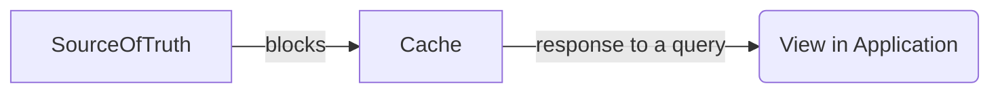
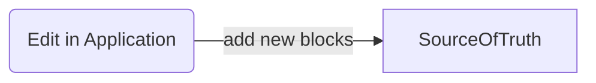

# Data Vendor Lock-In and Web3

## What is the biggest problem with Web2?

Most would say the biggest problem with Web2 is centralization. For example, we host our data using central services, like Web2 social networks, 
Web2 cloud providers, Web2 email providers, and others. We don’t have much control over our data using Web2 services. At any time, the service 
can refuse access to all or part of our data. People are 
[tired of switching platforms and losing their data](https://zulie.medium.com/what-youre-feeling-is-platform-fatigue-or-why-i-m-not-joining-threads-1e188369d25d).

## Does Web3 solve the problem of Web2?

According to [Wikipedia](https://en.wikipedia.org/wiki/Web3), one of the main properties of Web3 is decentralization. 
There have been multiple attempts to provide decentralized services. For example,

- social networks and messengers: [Mastodon](https://en.wikipedia.org/wiki/Mastodon_(social_network)), [Matrix](https://en.wikipedia.org/wiki/Matrix_(protocol));
- cloud providers, like [IPFS](https://en.wikipedia.org/wiki/InterPlanetary_File_System);
- finances: [Bitcoin](https://en.wikipedia.org/wiki/Bitcoin), [Ethereum](https://en.wikipedia.org/wiki/Ethereum);
- and source control systems: [Git](https://en.wikipedia.org/wiki/Git), [Mercurial](https://en.wikipedia.org/wiki/Mercurial).

However, these services don't really solve the fundamental problem that a user's data should belong to the user. Even if it is decentralized, we need 
different applications or services to access and store our data. Some decentralized services (like blockchain) might shut down or change their protocol, 
and we will most likely lose access to our data again. It could also be hard to reference the data from a new storage. On top of that, storing data in 
a blockchain could be pretty expensive. I don't want to pay for every message that I send to a friend.

Another problem with Web3 technologies, like blockchain, is that they are not designed for sub-networks. For example, often, a blockchain doesn't allow forking. 
How will it work if we would like to run the same internet on another planet while only having occasional synchronization? For example, a signal to Mars takes 
from 5 to 20 minutes. I know we are probably far away from this, but still, there can be other examples of isolated sub-networks that need to be synchronized 
occasionally.

So, instead of centralized data vendor lock-in, we now have decentralized data vendor lock-in. It's better but doesn't completely solve the problem at hand 
and it's not future-proof.

## What's a solution?

I think the solution is to switch our focus from protocols (how we access the data) to focusing on the structure of data and data formats.

Let's say I create some information, like a block of data. It can be an article, an image, a short text message, a document, or something else. 
Imagine we have a storage that keeps such blocks. Then, how can we uniquely identify the blocks and avoid duplications in the storage? 
Well, there is a family of functions/algorithms that can produce a unique identifier for any data block; they are called 
[cryptographic hash functions](https://en.wikipedia.org/wiki/Cryptographic_hash_function). 
For example: [SHA2](https://en.wikipedia.org/wiki/SHA-2), and [SHA3](https://en.wikipedia.org/wiki/SHA-3). 
This family of functions is already used by many decentralized systems. A storage that keeps data blocks and accesses 
them by a hash function is called a [hash table](https://en.wikipedia.org/wiki/Hash_table).

Note: A block of data is not a file. A file has additional information, such as a name and a file extension. A name of a file doesn't uniquely 
identify the data it holds. You may have multiple files with different names/paths that hold the same data.

## Data synchronization

If we keep our data in multiple file storages, we may face synchronization problems. Have you seen that message that repeats when you 
try to synchronize your files to a cloud file storage? "File already exists, do you want to replace it?". 
Honestly, the message freaks me out. I have no idea what I should answer. I just don't want to lose my data and avoid duplications.
However, if we keep our data in a big hash table, it's not a big deal to compare two hash tables and synchronize them. 
There are no merge conflicts, no prompts, no data loss, and no duplications.

## What happens if our hash algorithm is compromised?

In this case, we would freeze all our data, which is using the old hash algorithm, and make a kind of immutable registry of allowed/known hashes. 
This means we can't add new data using the old hash algorithm, but we can access it. For new data blocks, we can use a new hash algorithm that is not 
compromised yet.

For example, we have a [SHA1](https://en.wikipedia.org/wiki/SHA-1#SHAttered_%E2%80%93_first_public_collision) hash table:

| hash    | value |
|---------|-------|
| sha1(A) | A     |
| sha1(B) | B     |

After we find that the SHA1 is compromised, we create two new tables.
The first table is an immutable mapping from SHA1 to SHA256. No new blocks can be added to this table.

| hash    | value     |
|---------|-----------|
| sha1(A) | sha256(A) |
| sha1(B) | sha256(B) |

The second table is a new table with SHA256. We can add new blocks to this table.

| hash      | value |
|-----------|-------|
| sha256(A) | A     |
| sha256(B) | B     |
| sha256(C) | C     |

## How can we reference such data blocks from other blocks?

Most [URL schemas](https://en.wikipedia.org/wiki/Uniform_Resource_Identifier) specify a protocol, for example, `https://`. Even Web3 has URL-specific protocols, like `bitcoin://`. To reference a data block or a file, we don't have to use a specific protocol. Some URL schemas are protocol agnostic, such as the [URN family](https://en.wikipedia.org/wiki/Uniform_Resource_Name). Centralized registration authorities usually assign a URN for each resource. For example, [ISBN](https://en.wikipedia.org/wiki/ISBN) is used to assign unique numbers to commercial books.

To reference a data block, we shouldn't have to use a registry authority, even if it's decentralized. The URN has no sub-schema for hash-based names, but there is a URL schema that is designed specifically for this being [RFC6920](https://www.rfc-editor.org/rfc/rfc6920.html). This RFC describes two schemas: `ni` and `nih`. To put it briefly, the ni schema is for a data block hash, like `ni://sha256;....` The `nih` is for a short form of the hash; it works similarly to a tiny URL.

## Directed acyclic graph

If a data block can reference another data block, then such storage can be presented as a [DAG](https://en.wikipedia.org/wiki/Directed_acyclic_graph). Assuming that our cryptographic hash is strong, it is almost impossible to create cycle references.

Note: A tree is a special case of a DAG, and a blockchain is a special case of such a tree. When I want to create a new data block, I don't want to rely on a public blockchain like Bitcoin. Public blockchains are too expensive for such simple tasks.

## Source of truth and cache

A hash table storage should be considered a source of truth. It also can be used as a [source of events](https://martinfowler.com/eaaDev/EventSourcing.html). In hash table storages, we should only add new blocks but never delete old ones. If we want to delete an old block, we should add a new block that says the old one is deleted.

The storage may contain a vast number of blocks, and if we would like to understand the current state of the storage, we would need to traverse all blocks. Although, it would not be an efficient algorithm for a big hash table, especially for a large amount of users. However, we can use a cache to store the current state of the storage. One of the good properties of a cache is that it can be easily recreated from the source of truth. A good cache-creating algorithm can also be scalable and distributed between multiple nodes using advanced techniques such as [MapReduce](https://en.wikipedia.org/wiki/MapReduce).



The arrows show the direction of the data flow. SourceOfTruth is read-only for the Cache, and the Cache is read-only for View in Application.

If we would like to edit information, then we should add new blocks to the source of truth:



## User identity

A user should not rely on centralized authorities to create an identity. Instead, they should be able to create a unique [digital signature](https://en.wikipedia.org/wiki/Digital_signature), publish its public key, and sign messages using the signature. A user may also publish associated centralized identities (for example, email addresses), but these identities should be considered [temporary](https://www.nbcnews.com/tech/tech-news/elon-musks-takes-x-handle-longtime-twitter-user-rcna96074).

## Time stamping

Sometimes, signing a data block with a digital signature is not enough. A user may need to prove that they are the first who created the data block. Otherwise, another user can sign the same data block with their own digital signature.

To sign a data block with a time stamp, we need to publish a new data block that will reference the original one. The new data block would contain a signed time stamp using [trusted timestamping](https://en.wikipedia.org/wiki/Trusted_timestamping) services. There are also decentralized solutions, for example, using a blockchain. The timestamp can be used to prove that the data block was created before an event.

## Building data block formats for different applications

Here are some examples and thoughts about how we can make applications and services based on hash tables.

### A file catalog

Building a file catalog is very simple.

```json
{
    "files": {
        "a.jpg": "sha256:1234567890...",
        "f/a.jpg": "sha256:1234567890..."
    }
}
```

You may extend this format to include additional file attributes, such as executables.

### A source control system

A source control system is built similarly to a file, but it references previous file systems.

```json
{
    "previous": ["sha256:1234567890...", ""],
    "message": "commit message",
    "files": {
        "a.jpg": "sha256:1234567890...",
        "f/a.jpg": "sha256:1234567890..."
    }
}
```

Branches can be implemented either inside the data block (like in Mercurial) or outside (like in Git).

### Building a private group chat (social network)

Making a public group chat is quite easy. A private group chat may require additional thoughts.

We assume that our network protocol is encrypted, and we will only focus on the data that users receive and store. We cannot control what users are doing with our messages. They can store it, and some of them can even share it with others.

That leads us to the problem of how can we make sure that everyone receives the same information and if information is leaked how can we identify 
the source of the leak? When Alice sends a new message into a group chat, she sends it to all members of the group chat. After that, 
Alice sends different digital signatures for the message to each chat member. Each member of the group chat can verify that the message is signed 
by Alice. However, if the message is leaked, to prove that the message was sent by Alice, a whistleblower needs to uncover his identity.

### What else?

Task manager, calendar, resume, etc. They all should have very simple formats and should be easy to edit. 
Note, that the performance should be provided by the cache, not by the source of truth.

## How do we know what's the format of the file?

Unfortunately, there is no universal solution for this. We can try to parse the data with different readers/parsers and see if it's valid. Some applications may parse only a specific set of formats. We can also create a hint/container data block format, which will have an extension or MIME-type and a reference/contain to the data block.

```json
{
    "format": "hint",
    "extension": "jpg",
    "mime-type": "image/jpeg",
    "data": "sha256:1234567890..."
}
```

```
{
    "format": "container",
    "extension": "txt",
    "mime-type": "text/plain",
    "data": "Hello world!"
}
```

However, because we store different types of blocks in one storage, the data can be shared between applications of different vendors and types, 
for example between social networks, task managers, calendars, etc.

## What happens if a user's private key is stolen?

In this case, a user can publish a new public key and notify their friends. The friends can publish a block that confirms that they do not 
accept new blocks signed by the old user's key and accept only blocks that are signed with the new one.

## What I hope for

I would like to store data in such hash-table storage. I may have multiple storages, like public, private, and shared. 
Some of them may be in zero-knowledge encrypted storages, and some of them offline. Data blocks in the storage should still be able to reference each other. 
Then I can control access to the different storages by different applications.

Applications and services may have their own rules, and it's their right. If it is a social network, they may decide not to show some of my posts, 
they may even decline service to me. However, they can never delete my data and I can still access my data using different applications and services.

Also, I don't want to split my data between different services and applications. I would like to split my data by access, who can access the data.

The current state of the internet reminds me of email hosting from internet providers. Then, you are stuck with this internet provider. 
It's a data vendor lock-in. Our identity and data should not depend on the service provider, on a big or small company, 
not even on a decentralized specific blockchain. Social network applications/services should use my data, not store it in proprietary storage. 
I should be able to switch between different social networks without losing my data. I should be able to create my own social network application 
that will browse my data. How many times we should start it from scratch and lose our data?

- Hotmail, Gmail, ProtonMail,
- ICQ, Skype, Viber, WhatsUp, Telegram, Signal,
- Teams, Slack, Discord,
- LiveJournal, Facebook, Twitter, Instagram, Threads, Mastodon,
- SourceForge, BitBucket, GitHub, GitLab,
- Wikipedia, Quora, Reddit, StackOverflow,
- Google Drive, Dropbox, OneDrive, iCloud.
- Google Calendar, Outlook Calendar, Apple Calendar.
- Asana, Jira,
- LinkedIn, Hired, Upwork, Freelancer,

Please, stop! Enough! Really, it's enough! I like innovations, I like competitions, I like new start-ups, and 
I'm happy to change my internet/storage provider and applications. I'm okay with changing a communication protocol, however, 
I hate when I have to lose my data, my contacts, my communication, and other things. What is the point of sign-in to a new social network 
if your friends are not there? Or do I have to post my blogs on every social network? The data vendor lock-in problem is the biggest problem in Web2. 
Let's not carry it to Web3.

In the end, I would like to highlight four main principles that we should follow when building a decentralized internet for people:
- **Protocol agnostic storages.** It doesn't matter which protocol we use to transfer our data to storage.
  As soon as the storage receives new data, it is able to accept the data without conflicts.
- **Source of truth.** The user's data is a source of truth. Some services may store derived data, such as a cache,
  but it should be possible to recreate it from the source of truth if the derived data is lost.
- **No data vendor lock-in.** Applications and services should store user data in the storage of the user's choice.
- **Identity is decentralized.** Anyone can create new identities. The process doesn't require any registration authority.
  The identity is not tied to a specific service or application.
