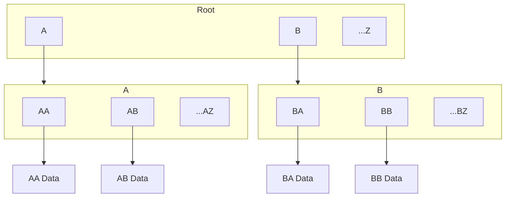

# Designing Network Protocol for CAS

## Internal Blockset Structure

Every repository can have multiple trees. Sometimes, we call the repository a forest. Every block of data is represented by one tree of hashes.

In reality, trees may share some nodes, so this set of trees is a DAG. Shared nodes mean that one or multiple data blocks share some data and don't need to keep the information twice. This is the main mechanism by which Blockset saves storage.

Every node is about several kilobytes and represents either data or a list of hashes.



## Adding a file to a remote repository

- less local memory
- more traffic

Requests: 
```
- AA
- AB
- ...AZ
- BA
- BB
- ...BZ
- ...ZZ
- A
- B
- ...Z
- Root
```

Each request sends one hash to a remote server, asking if it exists. If the server responds no, the client sends a corresponding data block to the server.

In the worst case, if the server always answers `no,` we send slightly more information to the server than the original file. 
In the best case, if the server always answers `yes`, we send only a tiny set of hashes and no data.

If we synchronize our repositories using file protocols (e.g., FTP) and copy, we will achieve the same level of traffic optimization. However, specialized protocols may further reduce traffic.

## Synchronizing a data block from a local repository

- more local storage
- less traffic

Requests: 

```
- Root
  - A
    - AA
    - AB
    - ...AZ
  - B,
    - BA
    - BB
    - ...BZ
  - ...Z
```

In the worst case, if the server always answers `no`, we send slightly more information to the server than the original file. 
In the best case, if the server always answers `yes`, we send only one `Root` hash.

## Synchronizing two repositories

Similar techniques can be used when communicating a set of root hashes to a remote server. This kind of optimization is helpful for repositories with millions of root hashes. 
