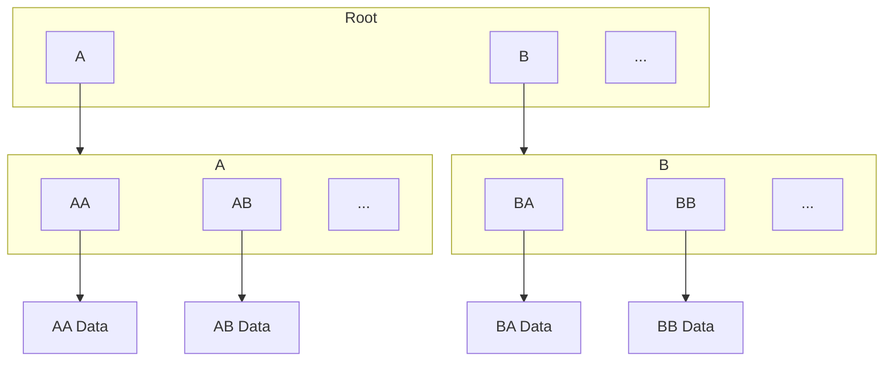

# Designing Network Protocol for CAS

## Internal Blockset Structure

Every repository can have multiple trees. Sometimes, we call the repository a forest. Every block of data is represented by one tree of hashes.

In reality, trees may share some nodes, so this set of trees is a DAG. Shared nodes mean that one or multiple data blocks share some data and don't need to keep the information twice. This is the main mechanism by which Blockset saves storage.

Every node is about several kilobytes and represents either data or a list of hashes.

## Streaming

- less local memory
- more traffic

Requests: `AA`, `AB`, ..., `BA`, `BB`, ..., `A`, `B`, ..., `Root`.

## Synchronizing Two Blocksets

- more local storage
- less traffic

## Hybrid Solution

