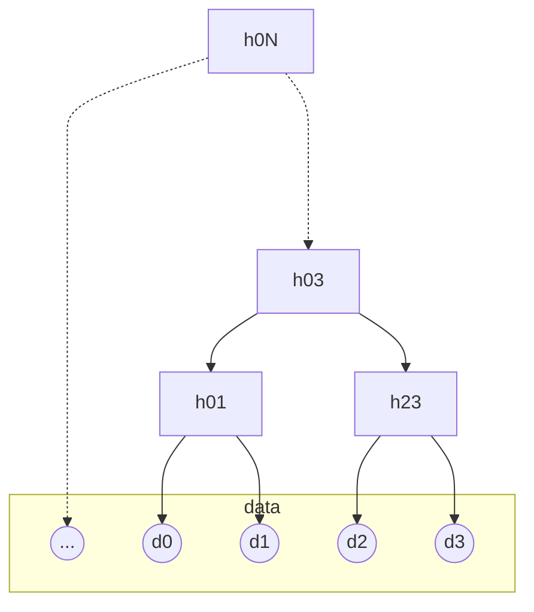
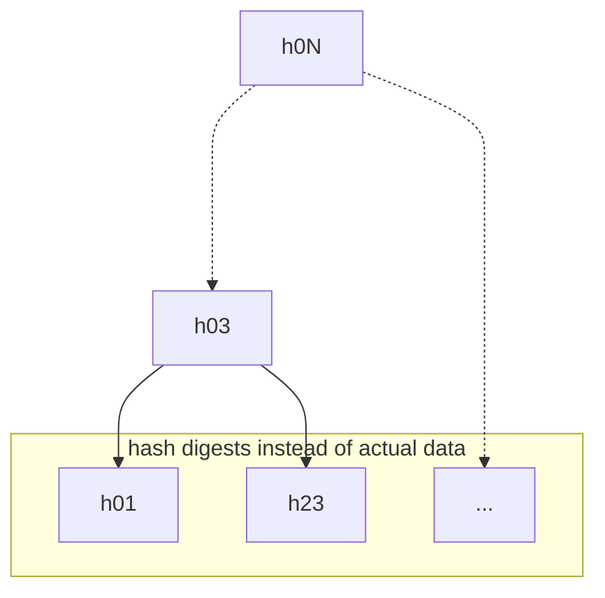
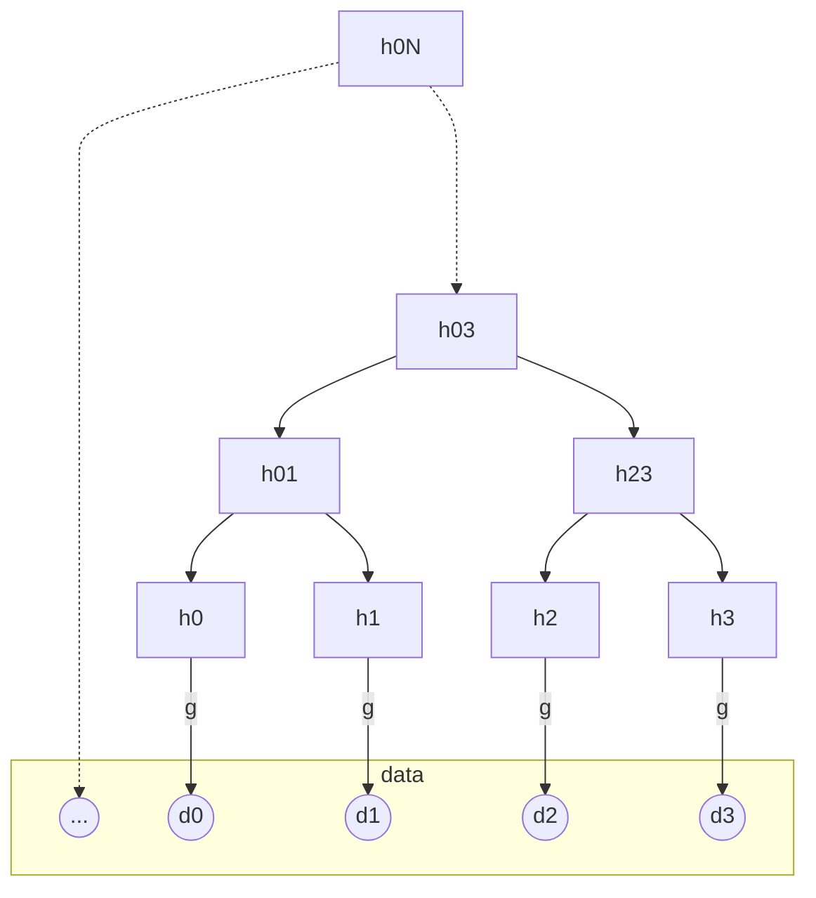
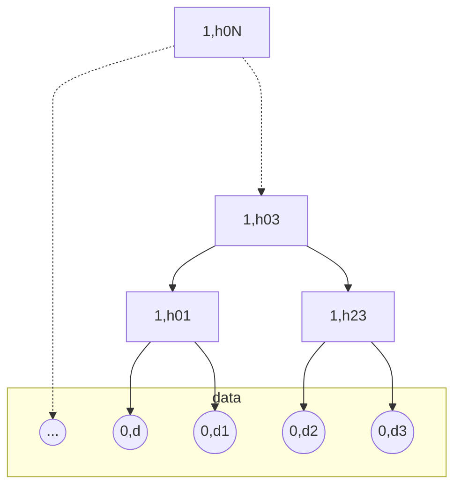

# Some aspects of Merkle Tree

Previously, I shared [my thoughts](https://https://github.com/sergey-shandar/public/blob/main/articles/data-vendor-lock-in.md) about how we can solve data vendor lock-in problem using [content-addressable network (CAN)](https://en.wikipedia.org/wiki/Content-addressable_network) and [content-addressable storage (CAS)](https://en.wikipedia.org/wiki/Content-addressable_storage) for personal use. As mentioned in the article, we don't care how our network works as long as we can download a data block for a specific hash because we can always validate the downloaded data against the hash value. There is one problem with validation. If the hash validation fails and our file is quite big (say several gigabytes),  we waste our network time and resources for nothing.

We wouldn't have such a problem if we could validate small parts of the data block while downloading the entire data block. One of the solutions is to use [Merkle Tree](https://en.wikipedia.org/wiki/Merkle_tree) for our hash function. There are a lot of good articles and videos about it, and I don't want to repeat them. I want to focus on some of the essential aspects of the Merkle tree that you should know if you would like to implement one.

## Definitions

`f` is a [cryptographic compress hash function](https://en.wikipedia.org/wiki/One-way_compression_function) that accepts two digests and returns one. For example, `h01 = f(h0, h1)`.

We split a data block into a list of digests `[d0, d1, ..., dN]`. Let's assume that `N` is `2^P`, where `P` is the height of the corresponding Merkle tree. Our tree will look like this:

## Second Preimage Attack

If we know data for a specific hash, we can create a collision because the tree doesn't distinguish between hash digest and data digests. So, it's possible to send hash digests instead of actual data. In this case, the validation will succeed, but the data will differ.

It's called [second preimage attack](https://en.wikipedia.org/wiki/Preimage_attack). To prevent such attacks, we need to separate data from hashes.

We can use another hash function for the data blocks to convert them into hash digests. Let's call it `g`.

The `g` function should differ from `f`.

Another way to fix the issue is to extend a digest with one bit. If the bit is
set to `0`, then it's data; otherwise, it's a result of the `f` hash function.

Note that such extended digest should not be used to transfer secure data because short messages can be easily restored.

## Tails

Actual data usually is not aligned to `2^P`. One way to fix the problem is to add one bit `1` and then fill the rest with  zeros.

## Length Extension Attack

If we have one Merkle Tree hash, we can use it as a node in another tree and create a valid hash for a new data block. This is called [length extension attack](https://en.wikipedia.org/wiki/Length_extension_attack). 
To solve it, we can transform a root hash into another hash before publishing it.

## No Shift Resistance

Merkle Tree is a very good idea to split data blocks into parts. We can even reduce traffic if some parts are the same. Or, we don't need to download some parts if we already have them in our hash table.  However, it only works if the same data parts are aligned with Merkle Tree parts. This is a big limitation of Merkle Tree.
