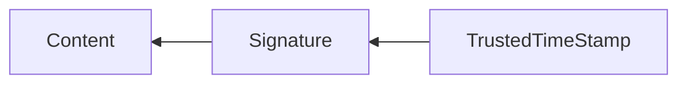

# Building Decentralized Self-Publishing Platform from Scratch. Workshop 1.

## Slide that shows

- FidoNet,
- Personal Website, E-Mails.
- WordPress, LiveJournal, MySpace, Facebook, Twitter, Cloud Data Storage (AWS, Azure, GCP), Centralized version control: CVS, Subversion.
- Attempts to fix:
  - Decentralized version control systems: Git, Mercurial.
  - Decentralized Storage: IPFS.
  - Social Networks: Mastodon/ActivityPub, SSB, Nostr, Bluesky/ATProto.

Where are you in the ocean? Where is your data? Where are your contacts, old friends? Where are their data and communications with them? It's all fragmented. Do new decentralized systems, such as ATProto, Nostr, and SSB, fix the problem? They try, but they have invented new things that are not compatible with the historical data. The problem is that we focus too much on protocol, like we do with Web2, but we need to focus on offline proofs. It doesn't matter how we receive the data, as long as we can prove important statements about the data, such as who created the data and when.

Two main properties of decentralized systems:
- global addressing, using cryptographic hashes. The hash is the document's address. If we don't have the document with such a hash, we can ask others if they have it, and we can use different protocols to do that. The important thing is that we can prove when we receive the document that it's a correct document.
- decentralized identity using public-private key cryptography.

Yes, we still need communication protocols and digital connections, but our data should be protocol-agnostic.

The modern Internet is still Web 2: centralized domains, Web Browsers that don't understand decentralized addresses or protocols without extensions. This significantly slows down decentralization and compromises users' digital rights. In this workshop, we would like to develop a system that keeps our data in future-proof storage and generates a view as a static Web2 website. It's Ok if we delete the site, change hosting, and domain; our data is still globally addressable. In the future, we may use different applications and protocols to view the data, but we don't need to "migrate" the data. This is what we call DISOT (Decentralized Immutable Source Of Truth).

## Why?

- **Data ownership.** Especially, it's crucial for historical data; your old posts, images, videos, code, etc. Where is it now?
- **Fight with fragmentation.** Most modern decentralized systems still follow the same paradigm inherited from centralized systems: define a protocol and data format and release software that works with these protocols and formats. That produces fragmentation. In rare cases, we see protocol bridges. We need a paradigm shift. How it should be done: We store all data in CAS and use CAS as a Decentralized Immutable Source Of Truth (DISOT). It could be blockchain blocks, IPFS files, Git commits, SSB/Nost/BlueSky messages. CAS doesn't care. Different applications should attempt to parse the data blocks; if they encounter blocks that cannot be parsed, they should skip those blocks. Applications may add new blocks to CAS, but obviously, they can't mutate existing blocks (by definition of CAS). See [IPLD](https://ipld.io/).

## What?

So like a decentralized WordPress, but you get to own the data, the software, and also where it goes. (So you can post it to any other system you want).

- **Software-level transparency.** You can write your own software, especially now that there are a lot of AI agents.
- **Cache.** To make parsing and indexing faster, some applications and services may use different types of databases to cache what has already been parsed. However, they should still reference CAS, since this is the primary source of truth. These DBs should be considered as derived data, and we should be able to restore them from CAS (our DISOT).

In this workshop, we will

1. Create CAS (as DISOT),
2. Define formats for blog posts, licensing, digital signatures, and trusted time stamps.
3. Render CAS content as static HTML.
4. Publish the HTML pages and public blocks from the CAS on a website.

**Technological stack:** TypeScript, ECMAScript modules, Node.js 24 with type striping. However, feel free to use anything else.

You can use AI agents.

## 1. CAS 

Content Addressable Storage.

### 1.1. CAS Interface

Write a library and CLI with the following interfaces...

```ts
type Data = Uint8Array
type Hash = bigint
type Nullable<T> = T | null

interface Cas {
  getData(hash: Hash): Nullable<Data>
}
```

Additional functions

```ts
interface CasInstance extends Cas {
  list(): Hash[]
  add(data: Data): Hash
}
```

### 1.2. Hash Function

```ts
type ComputeHash = (data: Data) => Hash
```

We select [SHA256](https://en.wikipedia.org/wiki/SHA-2). It's still considered cryptographically strong; many software libraries support it. Modern processors have hardware acceleration for the algorithm.

### 1.3. CAS Implementation

The `cas/` directory contains all blocks. Each data block is a file. The file name is a hexadecimal hash. For example

```
cas/
  17c94a0b6bb9ff1872e2f71ae2369be0e58000146d2e00f9f65ec38ffad347f9
  3e0f9d4c6b2e01d8a4a5fd9bc55dcf187a264a6d6e7e9fd28440de8a16236b3c
  962dc357e37c9bbd5e8088885e85f3f7c6e1b4eaf3e8c298b1ed7c259e297fba
  9a1d81a0d03aa1669982dbf739e4f3d5d8d9e50b3b1f01ac1d34b0e6b20c2cfd
  bb243f0150eae237d57b03bb301e1a7f662147389c51228c3dbe8b92d88f2634
  fbdac13e8fc909dd479d622128d7889e38943d7125b9e6a77a732f1feefcbe3c
```

Note that we don't add any metadata, such as file type, to the data blocks! It's more like [IPLD](https://ipld.io/) than [IPFS](https://en.wikipedia.org/wiki/InterPlanetary_File_System).

Write a simple console program that has these commands:

- `add <FILE>` - adding a new block to CAS and prints a hash of the file
- `get <HASH> <FILE>` - getting a block with the `<HASH>` and save it into the `<FILE>`.

## 2. DISOT

Decentralized Immutable Source Of Truth. Known formats:

1. content,
2. signature format,
3. trusted timestamp.



### 2.1. Content

Blog post format:

```ts
// https://creativecommons.org/share-your-work/cclicenses/
type License =
  "CC-BY 4.0" |
  "CC BY-SA 4.0" |
  "CC BY-NC 4.0" |
  "CC BY-NC-SA 4.0" |
  "CC BY-ND 4.0" |
  "CC BY-NC-ND 4.0" |
  "CC0 1.0"
type BlogPost = {
    license?: License,
    authors?: string[], 
    blogPost: string,
}
```

The assumption is that if there's a known public licence, it's public content.
If there's no licence, we must not publish it.

### 2.2. DID

```ts
interface Did {
    newPrivateKey(): string
    publicKey(privateKey: string): string
    sign(privateKey: string, contentHash: string): string
    verify(publicKey: string, contentHash: string, signature: string): boolean
}
```

Elliptic curves. [Secp256k1](https://neuromancer.sk/std/secg/secp256k1), the same one that is used in Bitcoin, Nostr, and Bluesky. 
- A private key is a scalar value, and it has a size of 256 bits.
- A public key is a point on an elliptic curve and has a size of 257 bits.

Implementation of `new`:

1. A function to generate a private key `privateKey`. For `secp256k1`, it should be 256 random bits. Use [Crypto.getRandomValues()](https://developer.mozilla.org/en-US/docs/Web/API/Crypto/getRandomValues). For example
   ```ts
   crypto.getRandomValues(new Uint8Array(32))
   ```
3. Calculate the `publicKey`. For example
   ```ts
   secp256k1.mul(secp256k1.G, privateKey)
   ```

A digital signature format:

```ts
type Signature = {
    publicKey: string
    contentHash: string
    signature: string
}
```

### 2.3. Selecting a time-stamping server.

Should support Secp256k1 or another elliptic curve algorithm.

## 3. Caching and Rendering

Read all blocks from a CAS and create a static HTML page.

## 4. Publish

1. Upload CAS as DISOT.
2. Upload the generated human-readable HTML as cache.

```
cas/
index.html
```

## 5. Additional Advanced Tasks

1. Replace the hex representation of hashes with Crockford's base32.
2. Split file names into subdirectories to reduce the number of files in one directory. For example, `ab/cd/ef01...`. Considering that hashes are distributed evenly, we can have only a few layers. For example, two letters of base32 give us a maximum of 1024 directories. Two levels of directories have about one million possible subdirectories. With two levels of directories, we can store approximately 1 billion files, where each directory contains around 1000 entities (files or directories). Our application should be able to read from any file structure.
3. A program should be able to discover the `cas/` directory in parent directories.
4. Implement CDT hash function instead of SHA256.
5. Replace TTP with [OpenTimestamps](https://en.wikipedia.org/wiki/OpenTimestamps).
