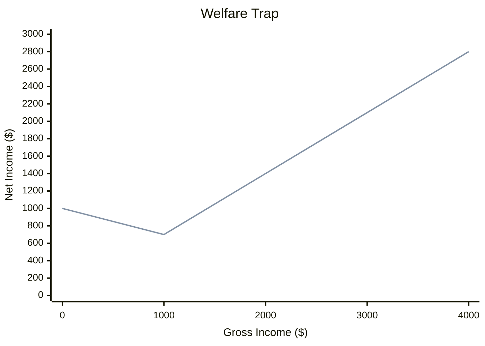
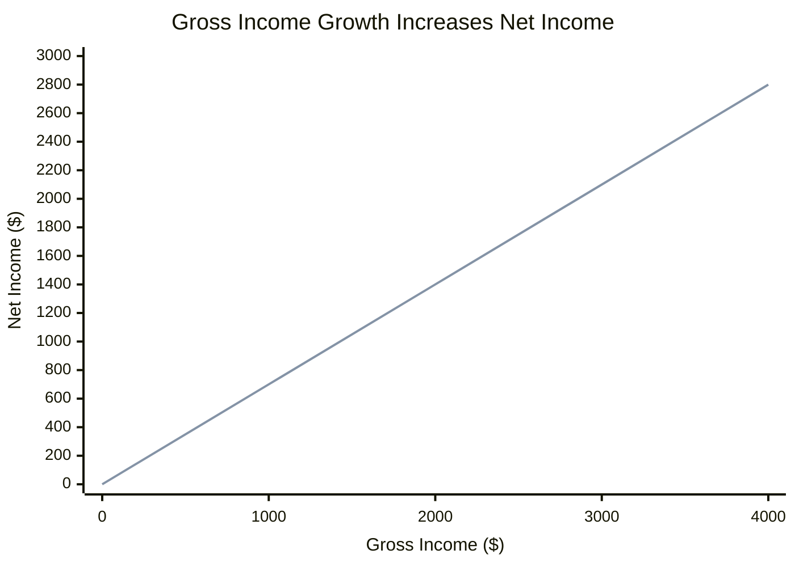
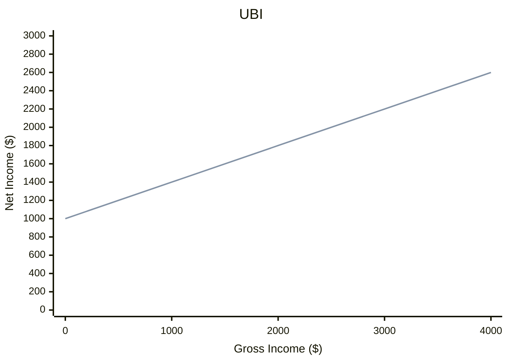
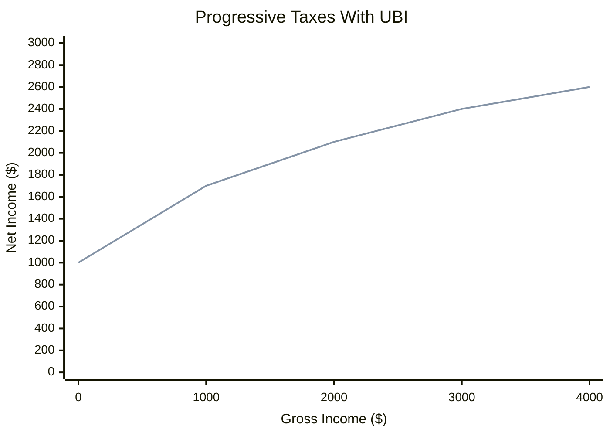

# Economic Justice In The Digital Age

We have a lot of computational power, but our tax systems have not evolved much. Often, these old systems have a negative impact on economies, lives, and societies. With AI’s ability to concentrate wealth and disrupt job markets, these flaws are accelerating.

Here, I’ve outlined principles based on common sense and a sense of justice. I believe that if these principles are applied properly, they can help address some of the problems. These principles are obvious and relatively easy to implement in our digital epoch.

## The First Principle: Gross Income Growth Increases Net Income

Consider two people, Bob and Charlie. They are identical in every respect except for gross income (before taxes).
The first principle is that if Charlie earns more than Bob, then Charlie must receive at least as much as Bob after taxes (net income).

Examples of violations include a [benefit cliff](https://en.wikipedia.org/wiki/Welfare_trap), where a slight increase in earnings results in a sharp drop in benefits. In this case, people lose motivation to earn more money legally.

Let's introduce a function `f` that converts a gross income `x` to the net income `y`.  The first principle says that the function `y = f(x)` is a non-decreasing function.

Also, all income should be considered the same for tax purposes. It doesn’t matter whether it comes from salary, business profit, or interest. We should not allow loopholes for tax optimization.

## The Second Principle: Basic Human Rights

Every person has a right to live. It means at least basic things: clean air, food, accommodation, and basic health care. Even people in prison receive these fundamental rights. Why should law-abiding individuals be denied these rights or have to break the law to access them? The statement is that people should have at least the same benefits that they can receive in jail. Then, if we agree with these first two principles, we cannot start at zero; we must implement [Universal Basic Income](https://en.wikipedia.org/wiki/Universal_basic_income) (UBI). 

`y = f(x) + U`, where `U` is UBI. `U` may vary with objective, non-income factors such as age or disability, but it must never depend on earned income.

## The Third Principle: Progressive Taxes

If Charlie earns more than Bob, he must pay at least the same tax percentage.

Examples of violations: Social Security tax in the US.

The progressive taxes work well to fight the growing inequality in wealth redistribution when the working class is getting poorer and poorer every year. One of the best candidates is `y = K * log(1 + x/K) + U`, where `K` is a scale factor. The logarithmic function always grows, ensuring the first principle holds, and it does not asymptotically flatten like some other functions. At the same time, logarithmic functions grow very slowly at high income levels, ensuring diminishing returns without imposing a cap.

The government may adjust `K` and `U` periodically to manage budgets, curb inflation, or correct unfair wealth distribution..

## The Fourth Principle: Accumulated Tax

If Bob received the same total amount as Charlie for the same period, they should pay the same taxes in total. For example, if Bob received $50K for the first year, and then $50K for the second year, and Charlie received $90K for the first year and then $10K for the second year, they should pay the same taxes for two years.

This principle prevents manipulation: whether someone earns more one year and less the next, or spreads income evenly across years, their total tax liability depends only on total income, regardless of when it is received.

This opens an interesting perspective: workers would receive tax returns upon job loss or retirement.

Another option is a student who may live on UBI during their studies and then pay less taxes for the first few years when they accept a high-paying job.

## Summary

The economy is not fundamentally about money but about producing value. Value creation is the fuel of the economic engine; money is the oil that keeps it running. These principles aim to prevent gaming of the tax system and turn the economy into a positive-sum game in which people can focus on creating real value rather than exploiting loopholes. They are a starting point for building a fairer, more resilient economy in the digital age. I welcome your feedback: Did I miss something important? How can we improve these principles?
