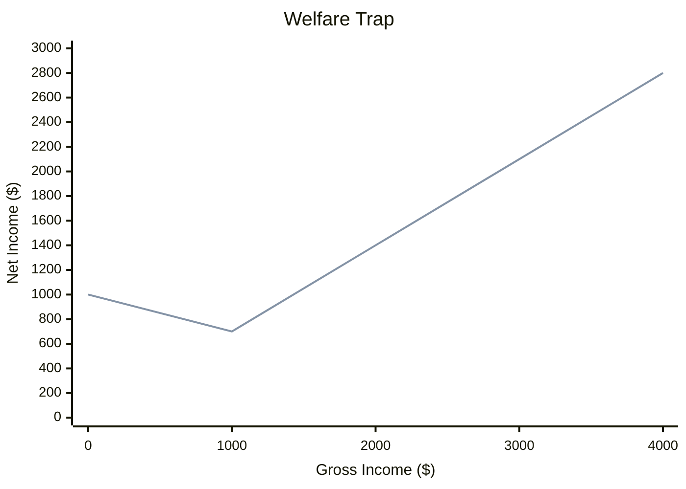
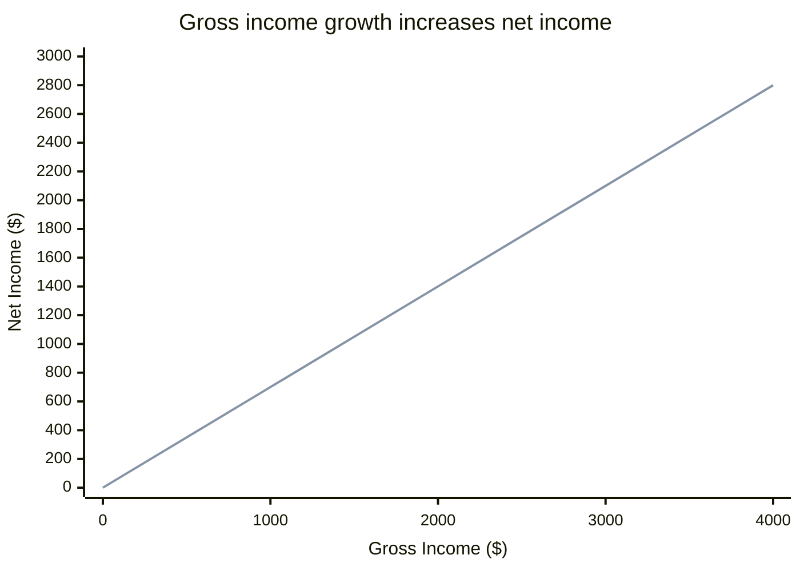
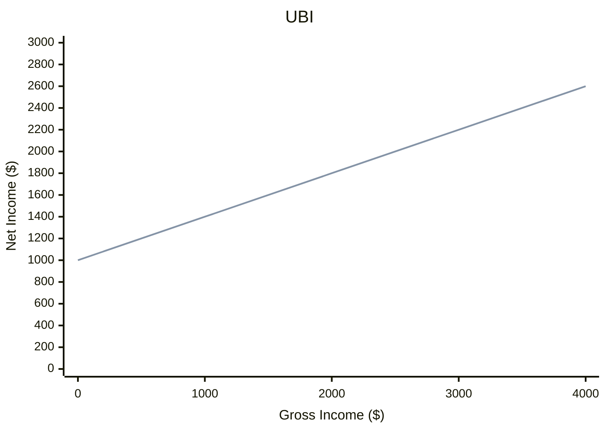
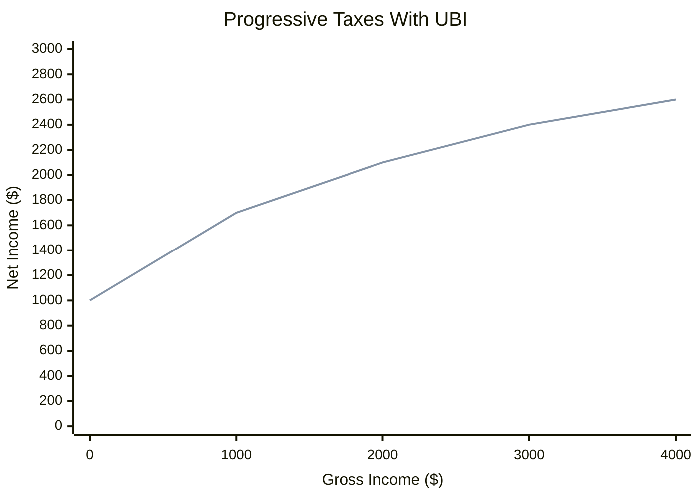

# Economic Justice In The Digital Age

We have a lot of computational power, but our tax systems have not evolved much. Often, these old systems have a negative impact on economies, lives, and societies. With AI’s ability to concentrate wealth and disrupt job markets, these flaws may accelerate.

Here, I formulated principles that should fix some of the problems. These principles are obvious and relatively easy to implement in our digital epoch.

## The First Principle: Gross Income Growth Must Increase Net Income

Let's take two people, Bob and Charlie. They are absolutely identical in everything except gross income (pre-tax).
The first principle is that if Charlie earns more than Bob, then Charlie must receive at least as much as Bob after taxes (net income).

Examples of violations include a [benefit cliff](https://en.wikipedia.org/wiki/Welfare_trap), where a slight increase in earnings results in a sharp drop in benefits. In this case, people lose motivation to earn more money legally.

Let's introduce a function `f` that converts a gross income `x` to the net income `y`.  The first principle says that the function `y = f(x)` is a non-decreasing function.

Also, all income should be considered the same for tax purposes. It doesn't matter if it comes from salary, business profit, or bank interest. We should not open doors for tax optimizations.

## The Second Principle: Basic Human Rights

Every person has a right to live. It means at least basic things: clean air, food, accommodation, and basic health care. Even people in prison receive these fundamental rights. Why don't law-abiding individuals have these rights? Why do we force people to break the law to have these fundamental rights? The statement is that people should have at least the same benefits that they can receive in jail. Then, we can't start with zero; we must have UBI if we agree with these first two principles. `y = f(x) + U`, where `U` is [Universal Basic Income](https://en.wikipedia.org/wiki/Universal_basic_income) and `U` must not depend on gross income.

## The Third Principle: Progressive Taxes

If Charlie earns more than Bob, he must pay at least the same tax percentage.

Examples of violations: Social Security tax in the US.

The progressive taxes work well to fight the growing inequality in wealth redistribution when the working class is getting poorer and poorer every year. One of the best candidates is `y = K * log(1 + x/K) + U`, where `K` is a scale factor. The `log` function always grows (the first principle), and it doesn't have a growth limit (like some asymptotic functions do).

## The Fourth Principle: Accumulated Tax

If Bob received the same total amount as Charlie for the same period, they should pay the same taxes in total. For example, if Bob received $50K for the first year, and then $50K for the second year, and Charlie received $90K for the first year and then $10K for the second year, they should pay the same taxes for two years.

This opens an interesting perspective: people who have worked their entire lives will receive tax returns as soon as they lose their jobs or decide to retire. So, it can replace a pension or provide extra net income for retired people.

Another option is a student who may live on UBI during their studies and then pay less taxes for the first few years when they accept a high-paying job.

