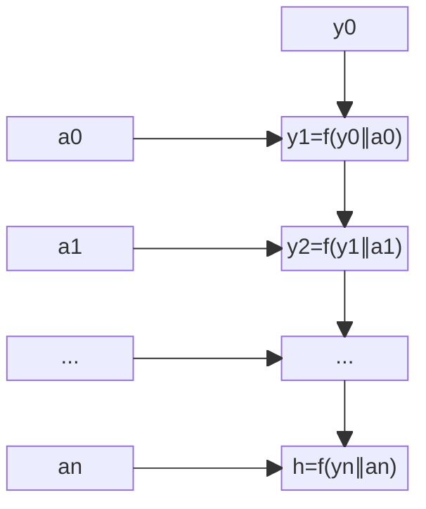
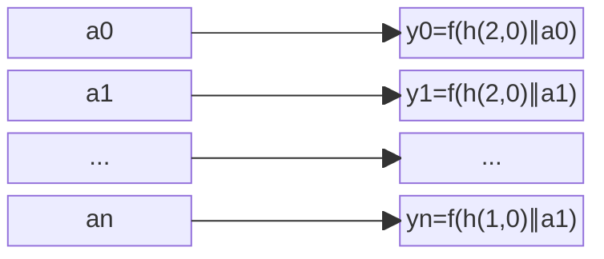

# Hash

The compress function $y = f(x)$

The function should satisfy these conditions:
- it's practically impossible to restore any part of $x$ from $f(x)$,
- It's practically impossible to find two $x_0$ and $x_1$ such that $f(x_0) = f(x_1)$.  

## SHA2 (32bits)

- $x$ is three 256bit values.
- $y$ is a 256 value.

### Streaming

Convert a bit stream into a list of 512bit values: $a_0, a_1, ..., a_n$.

The last value $a_n$ should contain `data`, then `10...` bits, then a 64bit length of the original data. All other $a_i$ contains only data. 

$y_0$ is an initial 256bit of SHA2, For example, for SHA2 it's `0x_6a09e667_bb67ae85_3c6ef372_a54ff53a_510e527f_9b05688c_1f83d9ab_5be0cd19`.

$y_{i+1} = f(y_i||a_i)$

### Merkle Tree

Convert a bit stream into a list of 256bit values: $a_0, a_1, ..., a_{2^k}$.

The last data value $a_m$ should contain `data`, then `10...` bits.
- $a_i$ where $i &lt; m$ contains only data,
- $a_i$ where $i>m$ contains zeros.

8 initial headers: $h(s, r) = f([x_0, s, r])$, where 
- $x_0$ is an initial value;
- $s$ is either `0` (zero bits), `1` (1..511 bits), `2` (512 bits), or `3` (merge);
- $r$ is either `0` (not a root), or `1` (a root).

Nodes:

$$y_{1,i} = \begin{cases}
  h(0, k = 1) \text{ if } s = 0,\\
  f([h(s, k = 1), a_{2i}, a_{2i+1}]) \text{ otherwise}.
\end{cases}$$

where $s$ is on a length of data $1..512$ in the sequence $a_{2i}, a_{2i+1}$.

$$y_{j,i} = \begin{cases}
  h(0, k = j) \text{ if } y_{j-1,2i} = y_{j-1,2i+1} = h(0, 0),\\
  f([h(3, k = j), y_{j-1,2i}, y_{j-1,2i+1}]) \text{ otherwise}.
\end{cases}$$

Note, if $y_{j-1,2i}$ and $y_{j-1,2i+1}$ are both zero-bit headers, then $y_{j,i}$ is also a zero-bit header.

