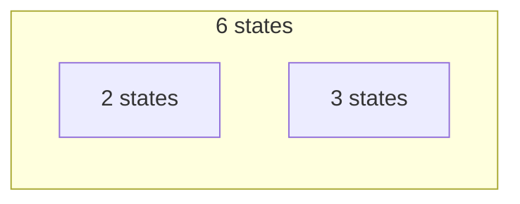
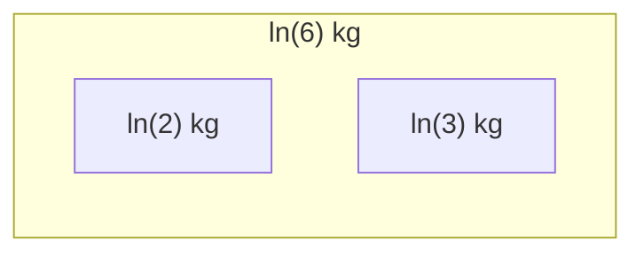

# Building Imaginary Universes. Etude 1. Information

One question I sometimes ask myself is: based on knowledge about the real world and logic, what kind of universes are possible?

This article is based on a series of basic questions I asked myself and the simplest answers I could come up with. If you find mistakes in my answers or have better answers, please let me know in the comments. In this case, the answer that is correct, simpler, and more precise is better.

- _Q. What are the main building blocks of any universe we can imagine?_

  A. It's information.

- _Q. How do we measure information?_

  A. Usually, we measure information in [bytes](https://en.wikipedia.org/wiki/Byte). For example, my computer has a memory of 8 [gigabytes](https://en.wikipedia.org/wiki/Gigabyte), which equals about 8 billion bytes.

- _Q. Can we divide the byte into smaller parts?_

  A. Yes, we can. Each byte contains 8 [bits](https://en.wikipedia.org/wiki/Bit). An object with only two possible states can be mapped into one bit, while an object with only one state doesn't carry any information. So, one bit is the smallest indivisible unit of information.

  ```mermaid
  flowchart LR
    subgraph byte: 256 states
      0[bit #0: 2 states]
      1[bit #1: 2 states]
      2[...]
      7[bit #7: 2 states]
    end
  ```

- _Q. Can we build a universe using only bits?_

  A. Perhaps, yes. At least all modern computers operate with bits, and we can model many things using them.

- _Q. Can we have other indivisible units of information?_

  A. Actually, yes. For example, an [object with three states](https://en.wikipedia.org/wiki/Ternary_numeral_system) can't fit into one bit, but an object with two bits has four states and can't fit into our three-state object. In the real world, we call them [elementary particles](https://en.wikipedia.org/wiki/Elementary_particle). For our imaginary universe, let's call them elementary objects, because a particle in the real world could mean much more than an object with a finite number of states.

- _Q. How many states does an object composed of multiple elementary particles have?_

  A. It's a [product](https://en.wikipedia.org/wiki/Product_(mathematics)) of the number of elementary object states. For example, we can calculate how many states are in 3 bits by multiplying 2 (the number of states) three times (the number of elementary particles).

  ```mermaid
  flowchart LR
    subgraph 8 states
      0[2 states]
      1[2 states]
      2[2 states]
    end
  ```  

- _Q. How can we know that an object is elementary?_

  A. If an object has a [prime number](https://en.wikipedia.org/wiki/Prime_number) of states, then the object is indivisible, elementary, and fundamental.

In summary, if we are building a universe that conserves a number of states in objects, similar to the [conservation laws](https://en.wikipedia.org/wiki/Conservation_law) in the real world, then our elementary objects are those that have a prime number of states, and a composed object has a number of states that equals the product of its subobject states. For example, an object with six states can be divided into two objects with two and three states.



- _Q. Can we use the number of object states as a characteristic similar to mass or energy in the real world?_

  A. The main difference is that in the real world, when we create an object from two objects, we usually add such properties as mass rather than multiplying them. For example, two 1 kg watermelons weigh 2 kg. To fix this, we can take a [logarithm](https://en.wikipedia.org/wiki/Logarithm) of the number of states. It doesn't matter which base of the logarithm we use because it is just a linear coefficient.

If our imaginary universe has only one type of elementary object, for example with two states, we can take that number as the base of the logarithm. This way, the logarithm of object states will always be a [natural number](https://en.wikipedia.org/wiki/Natural_number), excluding zero. For example, if our elementary object is a bit, then the logarithm with base 2 gives us the number of bits in the object. If an imaginary universe has multiple elementary objects, we can take an object with the smallest number of states as a reference point for our logarithm base.

$$\ln(6) = \ln(2 \cdot 3) = \ln(2) + \ln(3)$$



If you would like a small homework, prove the following statement: if we use the logarithm of state counts to measure mass, the mass of an elementary object divided by the mass of another elementary object is always a [transcendental number](https://en.wikipedia.org/wiki/Transcendental_number).

---

Information in bits. A number of states are more precise. The system with one state doesn't hold any information. 

If we have two systems with n0 and n1 states, then the number of combined states will be n0 and n1. If we try to divide a system with m states into two subsystems, we need to find such natural numbers n0 and n1 that n0*n1 equals m. 

If a system has a prime number of states, then such system is indivisible. The systems with the same number of states are not distinguishable.


