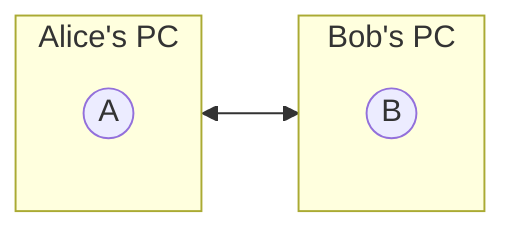
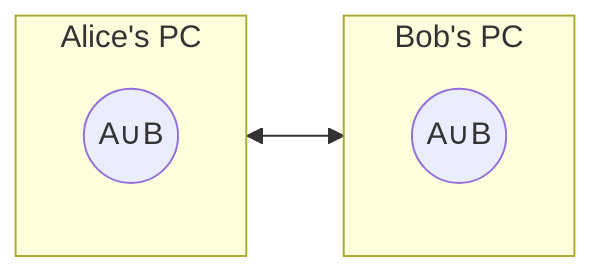

# How to calculate a set difference?

Imagine we have two sets of data blocks on two computers connected through the Internet. How can we synchronize these two sets using as little traffic as possible? 



Synchronize means that both computers have all data blocks from both original sets.



## Step 1. A cryptographic hash function to identify blocks 

To minimize the amount of traffic, we can use cryptographic hashes of the data blocks instead of the data blocks themselves. That's about 256 bits (32 bytes) per data block. Alice and Bob can send each other a list of their hashes and then request missing data blocks.

## Step 2. A cryptographic hash function for the list of hashes

Before sending a complete list, Alice and Bob can send each other hashes of their lists. We don't need to synchronize the sets if the hashes are identical. **Note:** To ensure that we have identical hashes for the same sets, the lists of hashes must be sorted.

## Step 3. A tree of hashes

If these two sets differ by only one item, we still need to send a complete list of hashes $O(n)$. However, we can divide a sorted list of hashes into two sublists. How we split the sorted lists should guarantee that if two lists differ by only one item, they should have one common sublist. To satisfy this condition, our split function should not depend on items already in the sublist but rather rely only on an item. $f(x)$ returns a sublist number, either $0$ or $1$; $x$ is an item hash. The simplest function is to take the highest bit of the hash.

By removing the highest bit from the hash, we can recursively apply the same split function to resulted sublists.

Tree structure for a sorted list of hashes.

### Example

```
22 38 41 56 63 6d 7d 7f 8f 9a 9b a8 ba c6 d0 da
```

```
|0
|0                      |8
|0    |4                |8             |C 
|22|38|4    |6          |8       |A    |c6|D
      |41|56|6    |7    |8f|9    |a8|ba|  |d0|da
            |63|6d|7d|7f   |9a|9b 
```

### The worst case

```
|0 
|00|8
   |80|C
      |C0|E
         |E0|F0
            |F0|F8
               |F8|FC
                  |FC|FE
                     |FE|FF
```
