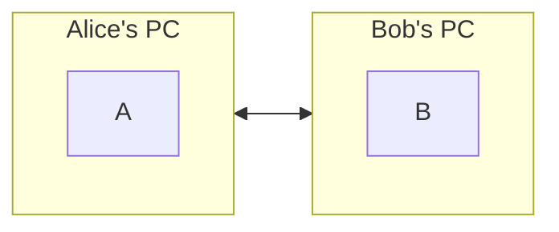
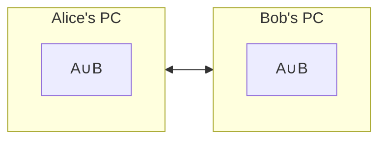

# How to calculate a set difference?

Imagine we have two sets of data blocks on two different computers connected through the Internet. How can we synchronize these two sets using as little traffic as possible? 

Synchronize means that both computers have all data blocks from both original sets.

## Step 1. Use a cryptographic hash function to identify a block 

To minimize the amount of traffic, we can use cryptographic hashes of the data blocks instead of the data blocks themselves. That's about 256 bits (32 bytes) per data block. Alice and Bob can send each other a list of their hashes and then request missing data blocks.

## Step 2. Use a cryptographic hash function for the list of hashes

Before sending a complete list, Alice and Bob can send each other hashes of their lists. If the hashes are the same, we don't need to synchronize the sets. **Note:** To ensure that we have the same hashes for the same sets, the lists of hashes have to be sorted.
